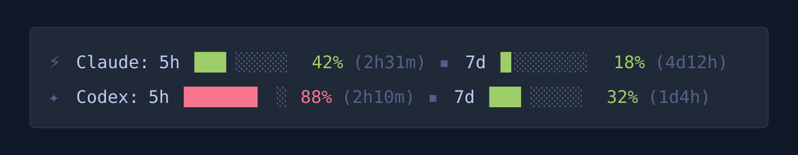

# Agent Quota for WezTerm


[Listed on Awesome WezTerm](https://github.com/michaelbrusegard/awesome-wezterm#ai)

A WezTerm plugin that shows Claude and Codex quota usage directly in the status bar.

It displays live 5-hour and 7-day usage windows, reset countdowns, process-aware `not running` states, compact percentage bars, and a shared cache so multiple WezTerm windows do not all refresh the same data independently.



## Features

- Claude 5-hour and 7-day utilization
- Codex 5-hour and 7-day utilization
- Reset countdowns for both providers
- Compact 8-cell percentage bars
- Process-aware `not running` status for Claude and Codex
- Shared per-user cache in `/tmp` across WezTerm instances
- Bundled Codex helper auto-discovery with no manual script-path setup
- Optional Claude usage dashboard shortcut
- Configurable status-bar side, icons, polling interval, and bar glyphs

Example output:

```text
Claude: 5h ███░░░░░ 42% (2h31m)  ▪ 7d █░░░░░░░ 18% (4d12h)  |  Codex: 5h ███████░ 88% (2h10m)  ▪ 7d ███░░░░░ 32% (1d4h)
```

## Requirements

Tested on Linux and Windows.

- [WezTerm](https://wezterm.org/)
- `python3` (or `python` on Windows)
- `curl` (bundled with Windows 10/11)
- Linux: `pgrep`, `ps`, `mkdir`, `rmdir`, and GNU `stat`
- Windows: `tasklist` (bundled) for process detection
- [Claude Code](https://docs.anthropic.com/en/docs/claude-code) installed and authenticated for Claude usage display
- [OpenAI Codex CLI](https://github.com/openai/codex) installed and authenticated for Codex usage display

If you only use one tool, the other side simply shows `not running`.

On Debian/Ubuntu, missing system tools can usually be installed with:

```bash
sudo apt install python3 curl procps coreutils
```

Expected credential files:

- Claude: `~/.claude/.credentials.json`
- Codex: `~/.codex/auth.json`

## Installation

Install it with WezTerm's plugin loader:

```lua
local wezterm = require("wezterm")
local config = wezterm.config_builder()

local quota = wezterm.plugin.require("https://github.com/M-Marbouh/agent-quota.wezterm")

quota.apply_to_config(config)

return config
```

Reload WezTerm with `CTRL+SHIFT+R`, or restart WezTerm fully.

No extra Python path configuration is required. The plugin resolves its bundled `codex-limits.py` helper automatically.

## Configuration

Pass options to `apply_to_config(config, opts)`:

```lua
quota.apply_to_config(config, {
  poll_interval_secs = 120,
  position = "left",
  dashboard_key = { key = "u", mods = "CTRL|SHIFT" },
  compact = false,
  icons = {
    claude = "⚡",
    codex  = "✦",
    week   = "▪",
  },
  bars = {
    enabled = true,
    width = 8,
    full = "█",
    empty = "░",
  },
  -- codex_script = "/absolute/path/to/codex-limits.py",
})
```

Options:

- `poll_interval_secs`: refresh interval for successful reads. Default: `60`
- `position`: `"left"` or `"right"`. Default: `"right"`
- `dashboard_key`: opens the Claude usage dashboard. Default: `CTRL+SHIFT+U`
- `compact`: hide reset countdowns to shrink the status-bar footprint. Default: `false`
- `icons.claude`: Claude prefix icon. Default: `⚡` (override to taste, e.g. `▲`)
- `icons.codex`: Codex prefix icon. Default: `✦` (override to taste, e.g. `◆`)
- `icons.week`: separator before the 7-day window
- `bars.enabled`: show compact percentage bars
- `bars.width`: number of bar cells
- `bars.full` / `bars.empty`: glyphs used for the bar
- `codex_script`: absolute path to `codex-limits.py`, overriding auto-discovery. Default: `nil` (auto-detect)

### Compact mode

Set `compact = true` to drop the reset countdowns from the status bar. Usage percentages and bars are kept, only the trailing `(2h31m)` style reset timers are hidden. This is useful on narrow terminals or when the status bar shares space with other widgets.

```lua
quota.apply_to_config(config, { compact = true })
```

### Codex script path

The plugin resolves its bundled `codex-limits.py` helper automatically. If auto-discovery fails in a custom setup, point `codex_script` at the helper directly:

```lua
quota.apply_to_config(config, {
  codex_script = "/absolute/path/to/codex-limits.py",
})
```

The path is resolved lazily on first use, so an incorrect value only affects the Codex side and never blocks Claude display.

## Windows

The plugin runs on native Windows WezTerm. Platform differences are handled automatically:

- Process detection uses `tasklist` instead of `pgrep`.
- The shared cache is written to the user temp directory (`%TEMP%`) instead of `/tmp`.
- Python is invoked as `python` when `python3` is not on `PATH`.

### Process detection

Claude and Codex fetching is gated on the corresponding CLI actually running, so process detection matters. Both tools install as npm shims but launch a bundled **native** binary as a child process, which appears in `tasklist` under its own image name:

- Claude Code runs as `claude.exe`
- Codex runs as `codex.exe` (the `node.exe` launcher spawns the native binary from its `vendor` directory)

The image name stays the same on both x64 and arm64, so `IMAGENAME eq claude.exe` / `codex.exe` matches on either architecture. You can confirm a tool is detectable while it is running with:

```powershell
tasklist /FI "IMAGENAME eq claude.exe"
tasklist /FI "IMAGENAME eq codex.exe"
```

If either command shows no process while the CLI is open, the status bar will show `not running` for that side.

## How It Works

Claude:

- reads the OAuth token from `~/.claude/.credentials.json`
- calls the Anthropic OAuth usage endpoint
- preserves stale data and backs off on repeated errors
- stops trusting stale data once a reported reset boundary has already passed, and briefly shows `syncing...` until fresh data arrives

Codex:

- runs the bundled `codex-limits.py`
- the helper starts `codex app-server --listen stdio://`
- reads `account/rateLimits/read`

Shared cache:

- Claude and Codex each write a per-user JSON cache file in `/tmp`
- a short lock directory prevents all WezTerm instances from refreshing at once
- other windows reuse the same cached result until it expires

Status display:

- shows actual usage only when the corresponding tool is running
- colors usage as green under `50%`, yellow from `50%` to `79%`, and red at `80%` and above
- renders compact 8-cell bars by default

## Compatibility

- Targets: Linux and Windows desktop sessions running WezTerm.
- Claude credentials are read from `~/.claude/.credentials.json`.
- Codex usage is read through `codex app-server --listen stdio://`, so the installed Codex CLI must support app-server rate-limit reads.
- Required command-line tools on Linux are `python3`, `curl`, `pgrep`, `ps`, `mkdir`, `rmdir`, and GNU `stat`; on Windows they are `python`/`python3`, `curl`, and `tasklist`.

## Known Limitations

- The plugin does not refresh Claude or Codex authentication itself; it waits for the corresponding CLI to keep credentials valid.
- Codex displays `not running` unless an interactive Codex process is attached to a terminal. Quota data may still be fetchable in the background, but the visible status remains process-aware.
- Claude usage calls are intentionally cached and retried with backoff to avoid unnecessary API pressure.
- macOS is not currently a tested release target.

## Troubleshooting

- Claude shows `not running`: confirm `pgrep -x claude` (Linux) or `tasklist /FI "IMAGENAME eq claude.exe"` (Windows) returns a process.
- Codex shows `not running`: open Codex in a WezTerm pane and keep that pane alive; detection uses WezTerm pane process info.
- Codex helper fails in a GUI PATH environment: run `python3 codex-limits.py` directly; the helper auto-discovers common `nvm` installs.
- Codex helper path resolution fails in a custom environment: set `WEZTERM_AGENT_QUOTA_CODEX_HELPER=/absolute/path/to/codex-limits.py` before launching WezTerm.
- Cached data looks stale: inspect or remove `/tmp/wezterm-quota-limit-"$USER"-*.json` and reload WezTerm.
- Codex helper is missing: ensure the full plugin repo was installed, not just `plugin/init.lua` by itself.

## Credit

Originally based on [wezterm-quota-limit](https://github.com/EdenGibson/wezterm-quota-limit) by EdenGibson. This fork significantly extends the original Claude-only plugin with Codex support, shared cross-window caching, process-aware status states, bundled helper discovery, compact usage bars, and additional reset/error handling.
